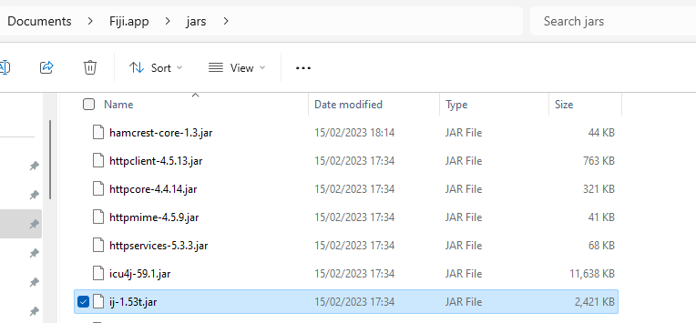
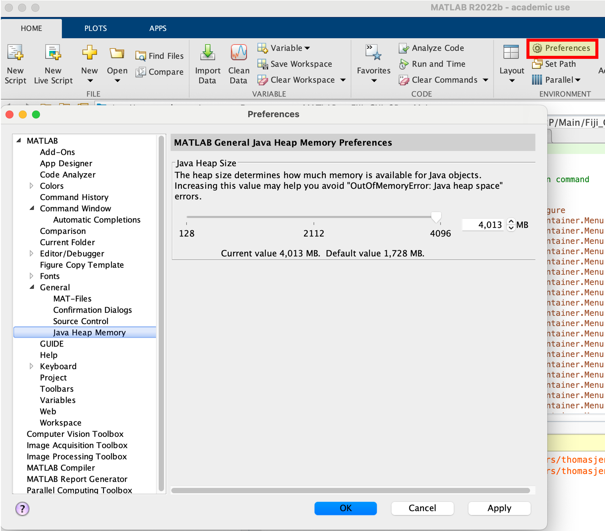
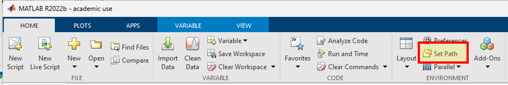
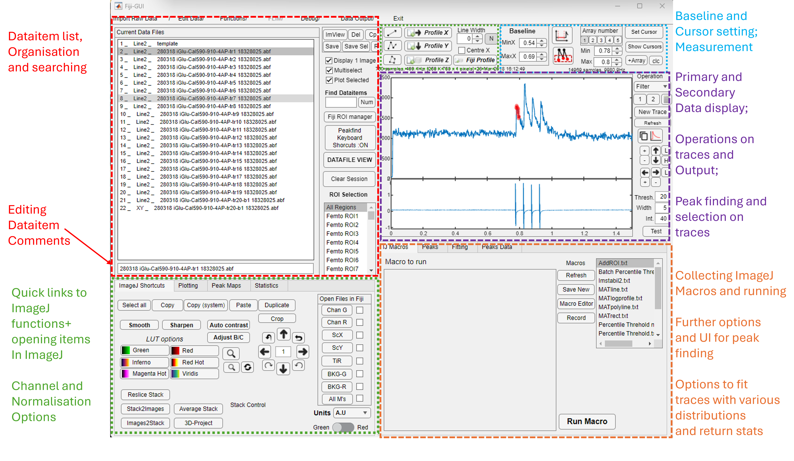
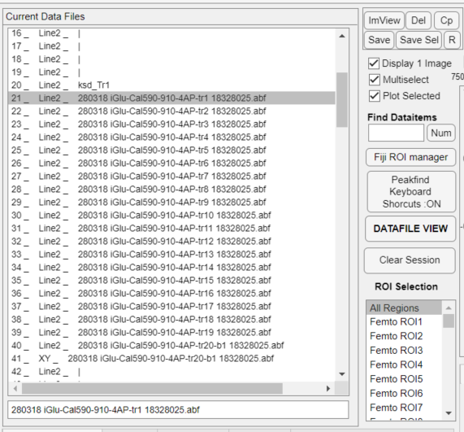

# Fiji-GUI.- Live cell Imaging and electrophysiology analysis GUI integrated with ImageJ

- **Highlights**    
    - Enable easy one-click access to ImageJ functions aided by metadata from the image loaded
    - Easy extraction of statistics from the imaging data, peaks timings and statistics can be found semi-automatically or manually for multiple channels without having        to reduce the dimensions of the data.
    - Ideal for working with episodic imaging data or from unstructured imaging data such as spontaneous responses or epileptiform activity.
    - Opens Femtonics .mes and .mesc files, preserving metadata on equipment states
    - Opens any imaging file type ImageJ can handle and enables combination with other data types such as patch clamp electrophysiology, FLIM and reference between data        types

Fiji-GUI is a MATLAB based neuroscience oriented data analysis program for integrated live cell imaging/electrophysiology data.  It is largely focused on time series (XT/XYT) image processing in the context of additional recording modalities such as patch clamp or field electrophysiology, but can also make some multi-purpose tasks carried out in ImageJ considerably more simple.

FIJI-GUI is designed around use opening Femtonics .mes and .mesc files but can effectively be used for any image file type supported be Fiji/ImageJ.  Specific routines are also present for managing Olympus .oib files and all imaging formats can be really combined with electrophysiology data from axon .abf or WinWCP .wcp files.

It works both as a quick button press interface for ImageJ functions buried within its menus and also for storing and running commonly used ImageJ macros.  It will carry out common normalisations on time series imaging data (DF, DF/F0, DF/R) as a one click process independent of the dimensions of the data.  Once combined with electophysiology data, MATLABs peakfinding algorthims can be used via the GUI to identify events occuring in either electrophysiology or imaging data.  Using these data the raw images can then be cropped without the need to manually identify the matching frame or pixel locations.    

In large part this is a wrapper for many inbuilt MATLAB functions and a number of 3rd party functions.  Extensive use is made of the following libraries for image input and output tasks and FIMAs for certain processing tasks.

**MIJ** by Daniel Sage et.al. [https://uk.mathworks.com/matlabcentral/fileexchange/47545-mij-running-imagej-and-fiji-within-matlab](https://uk.mathworks.com/matlabcentral/fileexchange/47545-mij-running-imagej-and-fiji-within-matlab)

**CopytoImagePlus** by Kouichi C. Nakamura [https://uk.mathworks.com/matlabcentral/fileexchange/67409-kouichi-c-nakamura-copytoimageplus](https://uk.mathworks.com/matlabcentral/fileexchange/67409-kouichi-c-nakamura-copytoimageplus)

**FIMAS** by Kaiyu Zheng

[https://github.com/zhengkaiyu/FIMAS](https://github.com/zhengkaiyu/FIMAS)

**abfload** by Harald Hentschke

[https://github.com/fcollman/abfload](https://github.com/fcollman/abfload)

And many others….

---

# Installation

Installing FIJI-GUI is a relatively simple process but unfortunately, to use the program with certain functionalities such as ImageJ integration it won’t compile as a .exe so the class file must be ran from MATLAB.

## **Hardware Requirements:**

Minimum recent PC or Mac, minimum 8GB if any large image volumes are to be processed, 16GB RAM would be recommended.  

## **Software Requirements:**

MATLAB 2022b or greater (for all features), I would not recommend the initial release of the most recent version; sometimes bugs remain.

For certain functions it is critical that the following toolboxes are installed: 

- Statistics and Machine Learning Toolbox
- Image Processing Toolbox
- Curve Fitting Toolbox
- Paralell Computing Toolbox
- Signal Processing Toolbox
- Wavelet Toolbox

[MathWorks - Makers of MATLAB and Simulink](https://uk.mathworks.com/?s_tid=gn_logo)

If ImageJ integration is wanted any recent Fiji package is required, most simply installed in /Documents folder. 

[Fiji Downloads](https://imagej.net/software/fiji/downloads)

## **Specific Installation notes**

1. Download .zip or clone the repository in Github 
2. Copy the Fiji.app folder downloaded into the Documents directory of your PC or Mac and add both folders to the MATLAB path. For instructions see below
3. Find mij.jar in the Fiji-GUI/Utility/For PC/ and copy to the MATLAB java folder
4. Open the [Fiji.app](http://Fiji.app)/jars folder and copy the ij-1.*.jar file (see below) to the MATLAB java folder.  
    
    On Mac this requires right clicking Fiji.app and clicking ‘**Open Package Contents**’, the same will have to be done to access the /java directory in the MATLAB app
    

The MATLAB/java directory should look similar to below once complete, 

### Increasing the Java heap memory

MIJ works to link ImageJ-MATLAB by running an instance of ImageJ within MATLAB.  Meaning that the size of the image being processed by ImageJ is dependent on the memory MATLAB allocates to it.  By default this is only 1GB or so, if one wishes to open large Frame Scans via MIJ it is recommended to increase this allocation by the following action.

In MATLAB open the Home tab and click Preferences.

Click on General and Java Heap Memory: use the slider to increase the value

Menu options to change Java Heap memory allocation

### Setting the default paths for the GUI

A key point for correct installation is to make sure the GUI knows where to look for files.  In the Fiji-GUI root folder the file defaultvars.m is present, the function in this file returns a structure containing defaults for various functions.  Lines 27-47 contain the default paths the GUI will search for change these to match the equivalent file locations on your computer.  

This file will also set many default variables for many functions so it may be worth looking through what can be preset before startup. 

### Setting the MATLAB path

Copy downloaded directorys to suggested locations

Open MATLAB and click on the Set Path icon in the Home Tab

Click Add with Subfolders pushbutton and Select the Fiji-GUI folder from the MATLAB folder repeat with the [Fiji.app](http://Fiji.app) folder in documents.

The process is much the same on a Mac, but [Fiji.app](http://Fiji.app) is displayed as a program rather than a directory.

---

# The Interface

The Fiji GUI interface is quite busy but I think reasonable user friendly.  I shall split it out to its main components below and try to highlight use cases.

### Dataitem List / input-output

The main point of interface is with the Listbox (app.Listbox2) displaying imported data displayed as the concatenation of the item number - data type  - the dataitem comment, which can be edited in the text field box below it.

A single click on an listbox item will call the function to parse the item, and display the averaged trace of the UG property (default) on the primary data axis with the Aux1 property (default) on the secondary axis.  Options in the GUI enable changing default channels, enabling common normalization parameters.  Choice to automatically open items in ImageJ…

Note the **Find Dataitems** textbox.

Often I will have recordings with >100 individual trials in different conditions, sometimes with multiple ROIs.  Once these are separated it can become time consuming to parse the file names/numbers.  As such I added a routine to search the comments field of the ImData array and return the items with either a text string or numeric index see video:
https://github.com/user-attachments/assets/9c5cf9cf-4420-4ef0-bc7e-4f4a6005e61f

# Data Import, Combination and Storage

All imaging data in Fiji-GUI is stored as a n by 1 array of ImData objects in the property **app.Datastore_class.**  

On startup the property is populated with an empty ImData object _template.  

The main point of interface is with the Listbox (app.Listbox2) displaying imported data displayed as the concatenation of the item number - data type (see) - comment.

If any operation adds or removes items from the app.Datastore_Class property the .findComment function should be called with this Listbox as the input argument.  This will repopulate the listbox with the updated list.

A single click on an listbox item will call the function to parse the status of the UI channel selections, and display the spatially averaged trace of the channel selected in the GUI.  By default this works via the UG property on the primary data axis with the Aux1 property (default) on the secondary axis.

**Data Import**

# Data Manipulation/Combination

## Cropping Data

By Selection

By ImageJ Selection

By Known timings

By Peak timings

## Binning Data

# Data Extraction

## Setting Cursors

## Peak finding

## Fitting functions

## Manual Peak selection

## Operations on data

# The ImData Class

## Imaging measurement data Properties

The base of the imaging data storage for Fiji-GUI is the ImData class structure, which holds the raw data in multiple channels as properties .UG, .UR, .TiR, .ScX, .ScY representing the Green, Red, Transmitted Light, Scanner X and Scanner Y co-ordinates.  

The context of the imaging data is represented by properties that store the expected dimensions of the data.  Vectors containing the scale of each dimension are stored as the properties .X,.Y,.Z,.T,.tauData, and the numeric reference dimension .X,.Y,.Z,.T,.tauDim.  

For instance a 2D Linescan has the 1st vertical dimension (Y axis) and 2nd horizontal dimension (Time) so TDim=2 and YDim=1.  A 3D frame scan has the 1st vertical dimension (Y axis), 2nd horizontal dimension (X axis) and 3rd Time dimension so TDim=3, YDim=1, XDim=2.  

Additional contextual properties are .x_pixel_num, .y_pixel_num, .x_pixel_size, .y_pixel_size, .linetime, these are carried over from Femtonics data and represent the image size and pixel sizes.

### Background Imaging data Properties

A secondary series of image files are also present. These ‘background’ images are raster scans recorded immediately prior the initiation of a time series acquisition and show the wider field image the scan was targeted at. These data are stored in the properties .bkgUG, .bkgUR and .bkgTiR.  The properties .bkgXData and .bkgYData store the scale, .bkgx_pixel_size, .bkgy_pixel_size, .bkgy_size and .bkgx_size store the pixel and image size.

## Data Types and Subtypes

ImData types are derived from the properties .Type, .file and .Subtype, these properties provide information on how the data should be evaluated during operations.

**Line1**: a 1D vector, intensity vs time or other unit

**Line2**: a 2D matrix with 2nd dimension representing time

- Subtype ‘Single’: the data represent a single continuous measurement. Y axis in most cases represents distance or pixel number.
- Subtype ‘Raster’:  A combination of multiple Line1 trials of the same measurement series.
- Subtype ‘FLIM t/T’ : Lifetime imaging data reduced to the first tau dimension vs Time 2nd dimension

**FF**: ‘FoldedFrame’ A 3D (or 4D) matrix representing frame scan recordings

- Subtype ‘Single’: the data represent a single continuous measurement. X and Y axis represents distance and Time is the 3rd dimension
- Subtype ‘FF4D’: These are XYTZ frame scans recorded when using the motorised microscope objective positioner

**XY:** These are morphology images, either single XY frame scans or Z Stacks.

Note: Time is always represented in data a whole seconds, although some UI elements use milliseconds for ease of thought.

*Future: the naming is a relic of the Femtonics .mes file naming conventions.  They may change to be more simple.*  

## Scanline, ScX/Y, predScX/Y, rois

These properties are derived from the Femtonics MES data structure.  The Scanline properties contain the information directing galvo scanners of the microscope for multiple patterns.  These are the command, or predicted locations at any time during a linescan or framescans.

The properties ScX/Y and predScX/Y are similar in that they describe scanner co-ordinates for every timepoint recorded in the image data properties (UG,UR,TiR etc.).  predScX/Y are derived from the scanline data, and are thus are the command scanner locations, ScX/Y are derived from the feedback signals from the Femtonics scanners during the measurement.

The ImData.Scanline.roi data represents the extents of the linescan regions of interest set when scanning in MES.  They are represented by a matrix containing in column 1 the line indices for the whole image, column 2 onward then contain the line indices for each ROI.  So for instance a linescan with 2 rois and 714 points may be represented as (1;714,1;306,307;714).  

**Femtonics ROIs in multi-spiral scans**

Although the scanline data described above is generally accurate; in multi-line and multi-spiral scans there are often portions of the regions that are NOT part of the ROIs but are flyback, or areas where the scanner moves between lines.  

This can be very problematic if processing steps such as the Spiral2Img/Pos2Img are to be used as they will include data that shouldn’t be present, or if the linescans have few pixels these data may be significant enough the dilute the recording from the ROI.

We expect that such regions in linescans may be present in data recorded on microscopes from other manufacturer's that don’t show the internal workings of the scope in their output.

**Limitations** 

Currently ROI storage are only supported in linescans, this is largely due to the complicated nature of ROI storage in .mes files.  

## Aux1, Aux2, eXData (Aux1XData….)

These channels are secondary non-imaging data that are recorded during the imaging experiment.  These may be:

Most likely patch clamp or field electrophysiology recordings, stimulation protocols such as TTL outputs onto uncaging lasers, temperature outputs from tissue baths.

Currently I use these for electrophysiology recordings: for example

Aux1 and 2 are the primary outputs of the first and second headstages on the ephys rig I use.  The sampling rate is much higher so a second variable for the time scale is required.  

This is eXData, and represents the scale of channels Aux1 and 2.  For flexibility and different use cases there are further variables present that haven’t been implemented.  Aux1XData, Aux2XData…:

These are in case there is need for multiple Auxiliary channels with different scales.  Much editing of code will be required to implement this correctly.   

# Data Output

All data, or a selection of data can be easily saved in the .MAT file format (although output as .FGUI), the class structure is converted to a MATLAB structure making it more easily read in other languages such as using pymatreader in python.

Images can also be saved as .tif files readable by ImageJ.

# Development

Largely I am not actively working on the GUI until I encounter a problem I need to resolve for work purposes.  Generally I would like to make it more robust at what it already does.

But when I have time I want to sort out ROIs import from Femtonics files to match how linescan ROI’s are handled.
